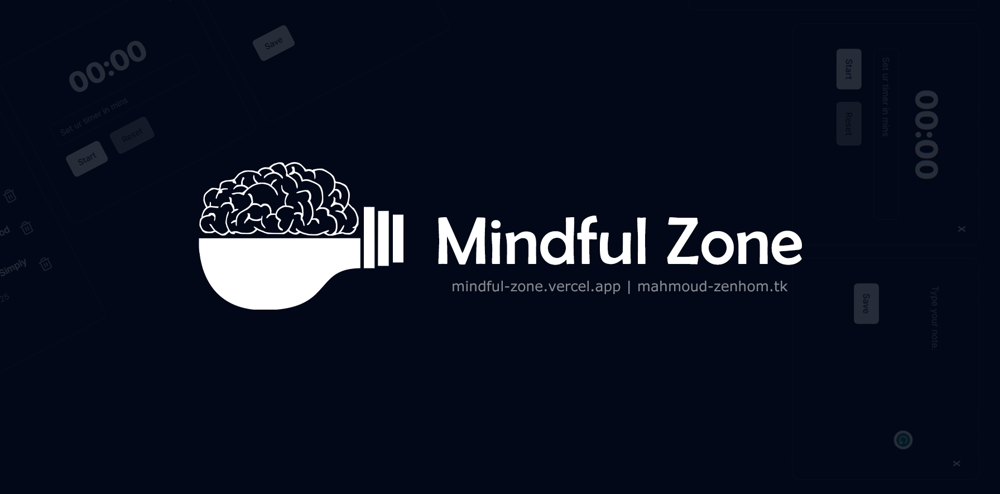

# [Mindful Zone](https://mindful-zone.vercel.app/)

Hello guys! I'm excited to share my new project using `Nextjs`.

[](https://mindful-zone.vercel.app/)

## Tech Stack

- Framework: [Next.js](https://nextjs.org)
- Styling: [Tailwind CSS](https://tailwindcss.com)
- UI Components: [shadcn/ui](https://ui.shadcn.com)
- State Management: [Zustand](https://zustand-demo.pmnd.rs)

## Features to be implemented

- [x] Todo-list
- [x] Timer
- [x] Counter
- [x] Notes
- [x] **More features are coming soon..**

## Installation

### 1. Clone the repository

```bash
git clone https://github.com/M-ZENHOM/Mindful-Zone
```

### 2. Install dependencies

```bash
npm install
```

## Deploy on Vercel

The easiest way to deploy your Next.js app is to use the [Vercel Platform](https://vercel.com/new?utm_medium=default-template&filter=next.js&utm_source=create-next-app&utm_campaign=create-next-app-readme) from the creators of Next.js.

Check out our [Next.js deployment documentation](https://nextjs.org/docs/deployment) for more details.
